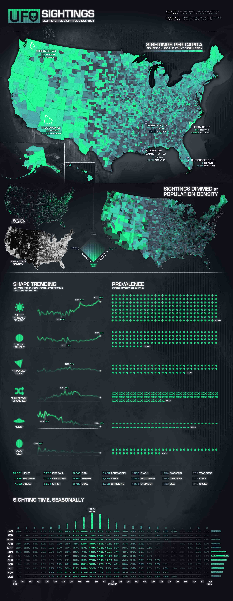
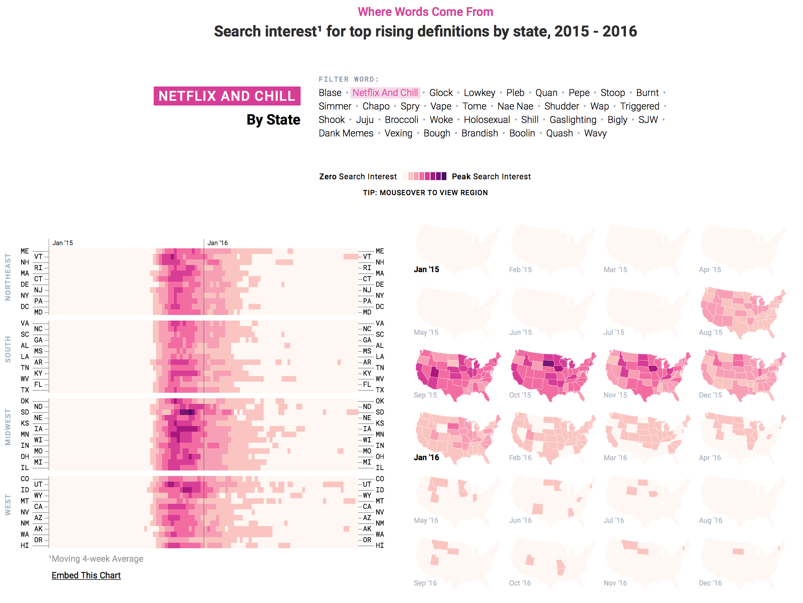

### Question 1 
#### Graph that I Like

The graph below visualize self reported UFO sightings in US since 1925. There are Several things I like about this visualization: 

1. Good first impression. It catch peoples' eyes in the beginning. 
2. Usage of transparency. It is not only applied to numbers but also on trending lines and histgrams.
3. The way that combining table and histogram helps us immediately figuring out the difference in numbers and the trend during all time periods.  

-- Graph Source: [uxblog](http://uxblog.idvsolutions.com/2015/06/sightings.html)



#### Graph that I don't like

These graphs below visualize several top search interest by states. Although this graph has a good first impression, after looking into the details, I found something not effective:

  1. Redundant. Left and right part convey almost same information. 
  2. Unclear. Left part tries to give each state a time trend line, but it is really hard to figure out which line belongs to which state. Moreover, even though the left hand side divides states into 4 regions, I do not think it is good way to show this information, it is much more clear to do it on the right hand side by highlighting the boundaries. 
  3. Missing information. Hawaii and Alaska are missing in maps on right hand side. 
  
-- Graph Source: [flowingdata.com](http://flowingdata.com/2017/01/26/language-in-2016-seen-through-google-search-trends/ )



### Question 2 
##### ch3.1 a) 
* Frequency Histogram: 
  + The range of the set of numbers in Galaxies is from 5,000 to 35,000. Most of them are between 15,000 to 25,000. There are roughly 5 numbers are between 5,000 to 10,000, 2 are between 10,000 to 15,000, 25 are between 15,000 to 20,000, 45 are between 20,000 to 25,000, 3 are between 25,000 to 30,000 and the same amount for 30,000 to 35,000.
* Box plot: 
  + The minimum of this data is about 16,000, the 1st quantile is about 19,000, median is about 21,000, 3rd quantile is about 24,000 and the maximum is about 27,000. Or from another point of view, we can say that 50% of data are within range 19,000 to 24,000, the smaller 25% data is located with 16,000, . data Also there exists several outliers on both sides. 
* Density Estimate:
  + Density graph is similar to histogram, but instead of dicrete values of x, now we can see a smoother trend through a contonuous desity line. 

```{r}
library(MASS)

par(mfrow=c(1,3))
hist(galaxies, main='Frequency')
boxplot(galaxies, main='Boxplot')
plot(density(galaxies), main='Density Plot')

```


##### ch3.1 b) 
I think the second one with breaks set to 20 is the best in the three histograms below. The binwidth of first graph seems too large that it ignores too much details and the binwidth of third one is too small for a dataset only containing 82 entries. 

```{r}
par(mfrow=c(1,3) )
hist(galaxies, breaks=5, main='Breaks=5')
hist(galaxies, breaks=20, main='Breaks=20')
hist(galaxies, breaks=50, main='Breaks=50')

```


Similar reasons for the density graph. By looking at the three different settings below, the graph default bandwidth, which equals to 1002, is the best, because the first graph shows too much details including 7 peaks and the third one with 1503 bandwidth seems too smooth.

```{r}
par(mfrow=c(1,3))
plot(density(galaxies, adjust = 0.5), main = '0.5*bandwidth')
plot(density(galaxies), main = '1*bandwidth')
plot(density(galaxies, adjust = 1.5), main = '1.5*bandwidth')

```


##### ch3.3 a) 
From histogram and density estimate graph we draw, bimodality could exists but it is not very obvious to see. 
```{r}
library(ggplot2)
ggplot(subset(survey, !is.na(Height)), aes(x=Height)) + 
    geom_histogram(aes(y=..density..), 
                   binwidth=2,
                   color="gray95", fill="darkorchid4", alpha=.7) +
    geom_density(color="goldenrod1") 
```

##### ch3.3 b) 

I prefer to set binwidth = 2. It is very easy to tell that the binwidth is too large in last two graph from the small amount of bars. The first graph with binwidth = 0.5 focuses too much on individul values which leads to very sensitive density values.

```{r}
library(gridExtra)

p1 <- ggplot(subset(survey, !is.na(Height)), aes(x=Height)) + 
    geom_histogram(aes(y=..density..), 
                   binwidth=.5,
                   fill="darkorchid4", alpha=.7) +
    geom_density(color="goldenrod1") +
    ggtitle("binwidth=0.5")

p2 <- ggplot(subset(survey, !is.na(Height)), aes(x=Height)) + 
    geom_histogram(aes(y=..density..), 
                   binwidth=2,
                   color="gray95", fill="darkorchid4", alpha=.7) +
    geom_density(color="goldenrod1") +
    ggtitle("binwidth=2")

p3 <- ggplot(subset(survey, !is.na(Height)), aes(x=Height)) + 
    geom_histogram(aes(y=..density..), 
                   binwidth=10,
                   color="gray95", fill="darkorchid4", alpha=.7) +
    geom_density(color="goldenrod1") +
    ggtitle("binwidth=10")

p4 <- ggplot(subset(survey, !is.na(Height)), aes(x=Height)) + 
    geom_histogram(aes(y=..density..), 
                   binwidth=15,
                   color="gray95", fill="darkorchid4", alpha=.7) +
    geom_density(color="goldenrod1") +
    ggtitle("binwidth=15")

grid.arrange(p1, p2, p3, p4, ncol = 2)

```

##### ch3.3 c) 
After separating Male and Female, bimodality shows clearly.
```{r}
ggplot(subset(survey, !is.na(Height) & !is.na(Sex)), aes(x=Height, color=Sex)) + 
  geom_density()
```


##### ch3.5 a) Lowest and highest 5% of the revenue values are extreme and boxplot is goot for showing outliers.

```{r}
suppressMessages(library(lawstat))
library(gridExtra)
data(zuni)
p1 <- ggplot(zuni, aes(x=Revenue)) + 
    geom_histogram(color="gray95", fill="darkorchid4", alpha=.7, bins = 30)

p2 <- ggplot(zuni, aes(x= factor("zuni"), y=Revenue)) + 
    geom_boxplot(color="darkorchid4", alpha=.7)

grid.arrange(p1, p2, ncol = 2)

```

##### ch3.5 b) Not symmetric.
```{r}
ss <- subset(zuni, Revenue >= quantile(Revenue, 0.05) & Revenue <= quantile(Revenue, 0.95))
ggplot(ss, aes(x=Revenue)) + 
  geom_density(color = "goldenrod1")

```

##### ch3.5 c) It looks like normal.

```{r}
ggplot(ss, aes(sample=Revenue)) + 
  stat_qq(color="darkorchid4", alpha = .7) +
  geom_abline(intercept = mean(ss$Revenue), slope = sd(ss$Revenue), color="goldenrod1")
```


### Question 3 

```{r}
suppressMessages(library(tidyr))
suppressMessages(library(dplyr))

tidy_p <- painters %>% cbind(Name = rownames(painters)) %>% gather(key = Division, value = Value, -School, -Name)
tidy_p$Division <- factor(tidy_p$Division)
```

```{r}
ggplot(tidy_p, aes(x="", y=Value, fill= Division)) +
  geom_boxplot(color = "gray20", show.legend = FALSE) +
  facet_grid(Division ~ School) +
  theme(strip.text.y = element_text(angle = 0))
```

* Strengths: Easier to compare data distribution among schools.
* Weaknesses: Hard to distinguish among Colour, Composition, Drawing and Expression, especially when the values are close to each other.


```{r}
ggplot(tidy_p, aes(x="", y=Value, fill= Division)) +
  geom_boxplot(color = "gray20", show.legend = FALSE) +
  facet_grid(School ~ Division) +
  coord_flip() + 
  theme(strip.text.y = element_text(angle = 0),
        axis.title.y=element_blank())
```

* Strengths: Easier to compare data distribution among Colour, Composition, Drawing and Expression.
* Weaknesses: Hard to distinguish among schools, especially when the values are close to each other.


```{r}
ggplot(tidy_p, aes(x = Name, y = Value, fill= Division)) +
  geom_bar(stat="identity", show.legend = FALSE)  +
  facet_grid(School ~ Division, scales = "free", space = "free") +
  coord_flip() + 
  theme(text = element_text(size=6), strip.text.y = element_text(angle = 0))

```

* Strengths: Showing details about each painter's value in 4 classes and painters are grouped by school.
* Weaknesses: Lacking high-level presentation of the distribution.


